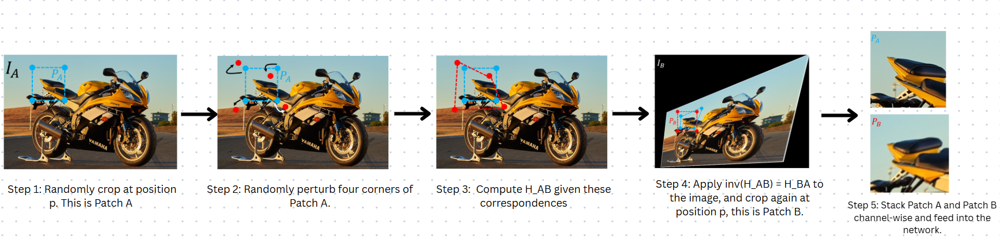
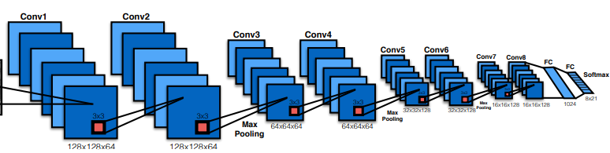
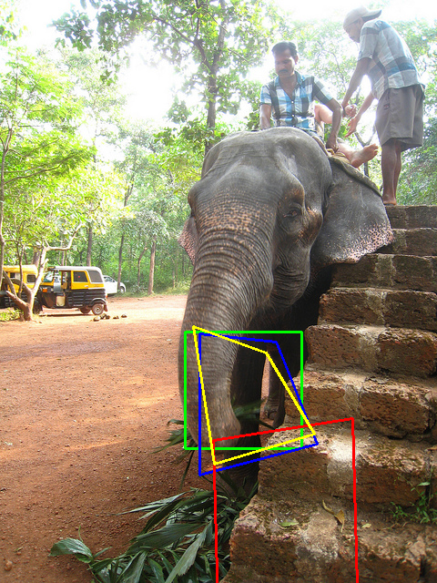
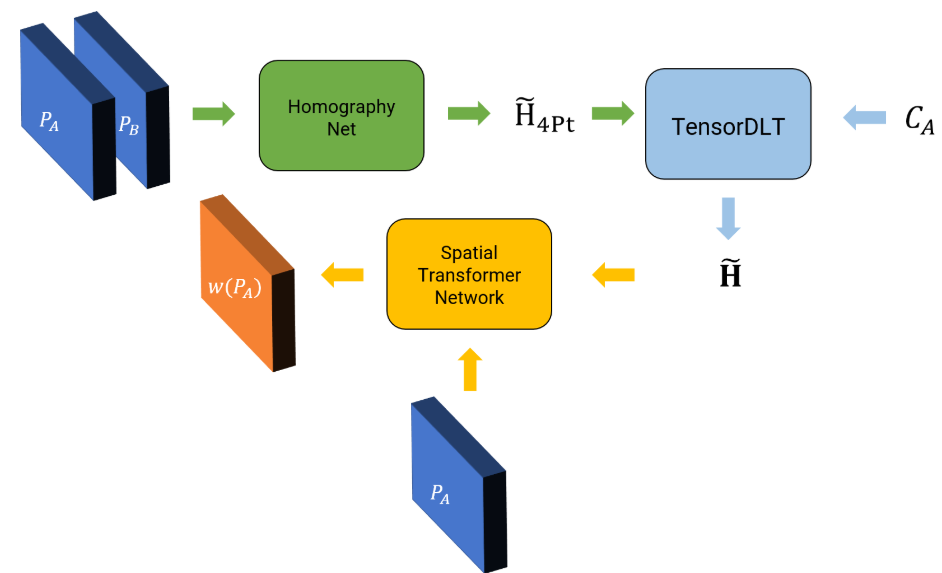

# Homography Estimation using Supervised and Unsupervised Deep Learning

This repository contains code which performs homography estimation for image patches/pairs which are either **low resolution** or have **less reliable features**, for whom the traditional method of finding homography using feature extraction and matching would fail.

## Supervised Learning Approach

To train a Convolutional Neural Network (CNN) to estimate homography between a pair of images (this network is called the HomographyNet), data or pairs of images are required with the known homogaraphy between them. This is in-general hard to obtain as the 3D movement between the pair of images would be required to obtain the homography between them. 
An easier option is to generate synthetic pairs of images to train a network. Hence, the a small subset of images from the MSCOCO dataset is used to obtain image patches to train the network on.

### Dataset Generation
In this, patches are generated from the MSCOCO images with known homographies. While stakcing these patches, augmentation like **Motion Blur** and **Occlusions** are added to the Patch B, so that the process can be generalized to different images and becomes more robust to any noise addition or translation. Motion Blur is an effect which occurs when a camera or object moves during exposure, causing streaks in the image. Occlusions, on the other hand, happen when parts of an object are blocked by another object in the scene.

The pipeline is shown in the image:

    

### Training the CNN
Neural Network Structure:

    

### Results
The training was done successfully, with reduction in loss over the training and validation set. To visualize the result, we compare the homography estimation using the deep learning approach with the traditional approach using feature extraction and matching.
In the image shown below, the 
green box represents Patch A, 
the blue box represents Patch B, 
the yellow box represents the patch predicted from the network, and 
the red box represents the patch obtained using the traditional approach.

    

The 4 point homography predicted can be converted to a **homography matrix** for **image stitching** purposes using **Direct Linear Transform (DLT)**.

## Unsupervised Learning Approach
Though the supervised deep homography estimation works well, it requires a large amount of data to generalize effectively and is generally not robust if proper data augmentation is not provided. 
The data generation process remains exactly the same for this part, but the labels H4Pt are not used for learning in the loss function. 

For the unsupervised method, the value of H4Pt is predicted, which, when used to warp the patch P_A, should make it look exactly like the patch P_B. This can be expressed as the photometric loss function l, given by: $\( l = \| w(P^A, H_{\text{4Pt}}) - P^B \|_1\)$. Here, w(·) represents a generic warping function, specifically warping using the homography value and bilinear interpolation.

In this approach, we introduce two new components, namely, **TensorDLT** and the **Spatial Transformer** Network. The TensorDLT component takes as input the predicted 4-point homography H˜4Pt and the corners of the patch P_A to estimate the full 3×3 estimated homography matrix H˜. This estimated homography matrix is then used to warp the patch P_A using a **differentiable warping layer (utilizing bilinear interpolation) called the Spatial Transformer Network**.

For the TensorDLT module, homograhphy computation is done using the Kornia library, which helps produce a differentiable version of the process, so that it can be used for computing gradients.

The overall unsupervised learning approach is shown below:

    

### Results
Although the training MSE loss reduced steadily during training, the value of the MSE loss was overall high since it is relatively tough to train an unsupervised model and reduce loss to a loew value. Since we are directly outputting the warped image using the network, significant tuning and more time would be required to train the network for better results.

## References
This implementation is based on the following papers:
- DeTone, D., Malisiewicz, T., & Rabinovich, A. (2016). Deep image homography estimation.[Link](https://arxiv.org/pdf/1606.03798)
- Nguyen, T., Chen, S. W., Shivakumar, S. S., Taylor, C. J., & Kumar, V. (2017). Unsupervised deep homography: A fast and robust homography estimation model. [Link](https://arxiv.org/abs/1709.03966)
